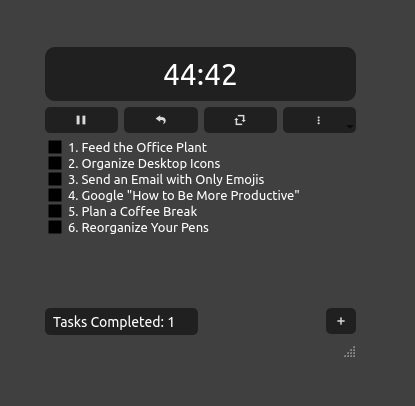
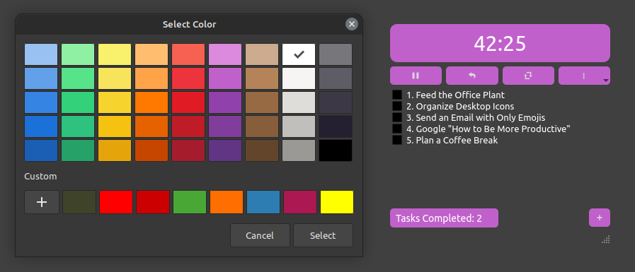

# Pomodoro Timer App

Welcome to the **Pomodoro Timer App**! 🎉

Stay productive and manage your time effectively with our sleek and simple Pomodoro timer. Designed to help you work in focused bursts with regular breaks, this app is your new productivity companion.




## Features

- **Pomodoro Timer**: 25-minute focus sessions
- **Break Timer**: 5-minute breaks
- **Task List**: Manage your tasks and mark them as complete
- **Customizable**: Change colors and opacity to suit your style
- **Stay on Top**: Always on top of other windows
- **Sound Notifications**: Alerts you when time is up

## Installation

### Prerequisites

- Python 3
- PyQt5

### Steps

1. **Clone the Repository**:
   ```sh
   git clone https://github.com/yourusername/pomodoro-timer.git
   cd pomodoro-timer
   ```

2. **Install Dependencies**:
   ```sh
   pip install PyQt5
   ```

3. **Run the App**:
   ```sh
   python3 pomodoro.py
   ```

### Running in Background in Linux

To run the app in the background and access it easily, add an alias to your shell configuration.


1. **Edit `.bashrc_aliases`**:
   ```sh
   nano ~/.bashrc_aliases
   ```

2. **Add the Alias**:
   ```sh
   alias pomodoro='nohup python3 /path/to/pomodoroapp/pomodoro.py > /path/to/pomodoroapp/pomodoro.log 2>&1 &'
   ```
    - We use the nohup command to run the script detached from the console:
    - nohup: Runs the command such that it ignores the hangup signal.
    - python3 pomodoro.py: The command to run your Python script.
    - > pomodoro.log: Redirects the standard output to pomodoro.log.
    - 2>&1: Redirects the standard error to the same file descriptor as standard output.
    - &: Runs the command in the background.

3. **Source `.bashrc_aliases`**:
   ```sh
   echo 'source ~/.bashrc_aliases' >> ~/.bashrc
   source ~/.bashrc
   ```

Now you can start the Pomodoro timer with a simple `pomodoro` command!


### Running in Background in Windows

Here are the steps to run your Pomodoro Timer script in the background using just a batch script:

This batch script will allow you to start your Python script in a detached mode using `pythonw.exe`, which is the windowless version of Python that doesn't open a console window.

#### Step 1: Create a Batch Script

1. **Create the Batch Script**:
   - Create a new file named `run_pomodoro.bat` in the same directory as your Python script.

2. **Edit the Batch Script**:
   - Add the following lines to `run_pomodoro.bat`:

     ```batch
     @echo off
     start "" pythonw.exe "C:\path\to\your\pomodoroapp\pomodoro.py"
     ```

   - Replace `C:\path\to\your\pomodoro.py` with the actual path to your Python script.

#### Step 2: Run the Batch Script

1. **Double-click the Batch Script**:
   - Simply double-click `run_pomodoro.bat` to run it. This will start your Python script in the background without opening a console window.

2. **Verify the Script is Running**:
   - Open Task Manager (Ctrl + Shift + Esc) and look for `pythonw.exe` in the list of processes. This indicates that your script is running in the background.


This method is simple and doesn't require any additional tools beyond what is already available on Windows.

## Contributing

Got ideas? Found a bug? Feel free to open an issue or a pull request. Contributions are welcome!

## License

This project is licensed under the MIT License.

## Acknowledgements

Thanks to all the awesome developers and designers out there who inspire us to create cool stuff!

---

Stay focused, stay awesome! 🚀
